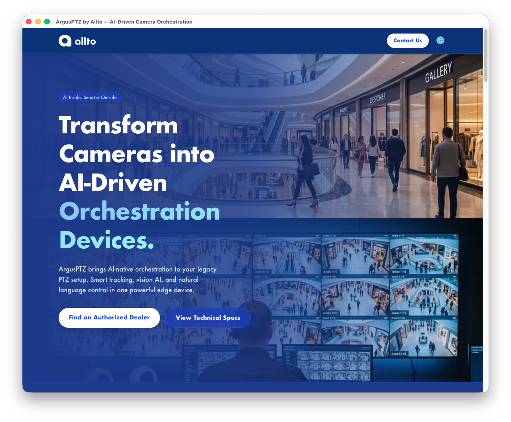
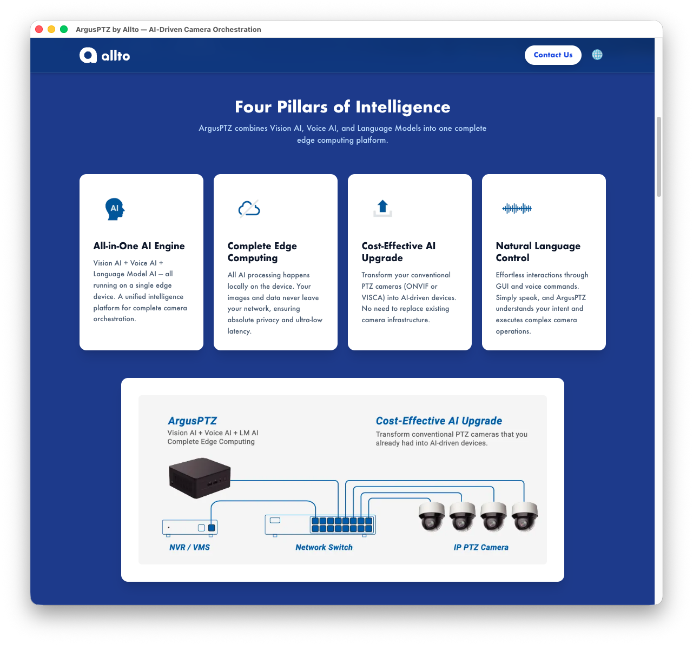

# Brand Landing Page - Project Portfolio

## Project Overview
**Brand Landing Page** is a professional and responsive web presence designed to introduce the brand's core products and effectively drive conversions. Its primary goal is to showcase product features compellingly and seamlessly direct users to authorized dealers for purchase. It adopts a "Blue Primary, White Secondary" color scheme, utilizing a deep blue background with high-contrast white cards to maintain a premium visual aesthetic and ensure readability.

**Built with:**

## Key Features
*   **Blue Theme UI**: Incorporates a deep blue background with clean, high-contrast white design elements.
*   **Responsive Layout**: Fully responsive HTML/CSS structures optimized for both desktop and mobile viewports.
*   **Secure Infrastructure**: Containerized using Docker Compose and served securely over HTTPS with automatic SSL via Caddy.
*   **Dynamic Interactions**: JavaScript-powered dynamic components to provide smooth user interactions.
*   **Conversion Focused**: Strategically placed Call-to-Actions (CTAs) that effectively guide users from product exploration to dealer purchasing portals.

## UI Gallery

### Home Page
The main entry point featuring the core product showcase, brand message, and clear call-to-actions.

### Product Details
In-depth view of the product's key features and specifications presented in high-contrast white cards.

