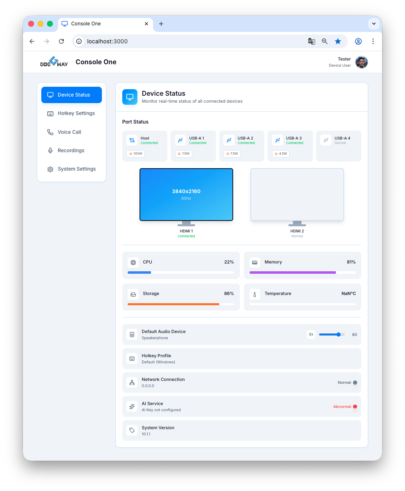
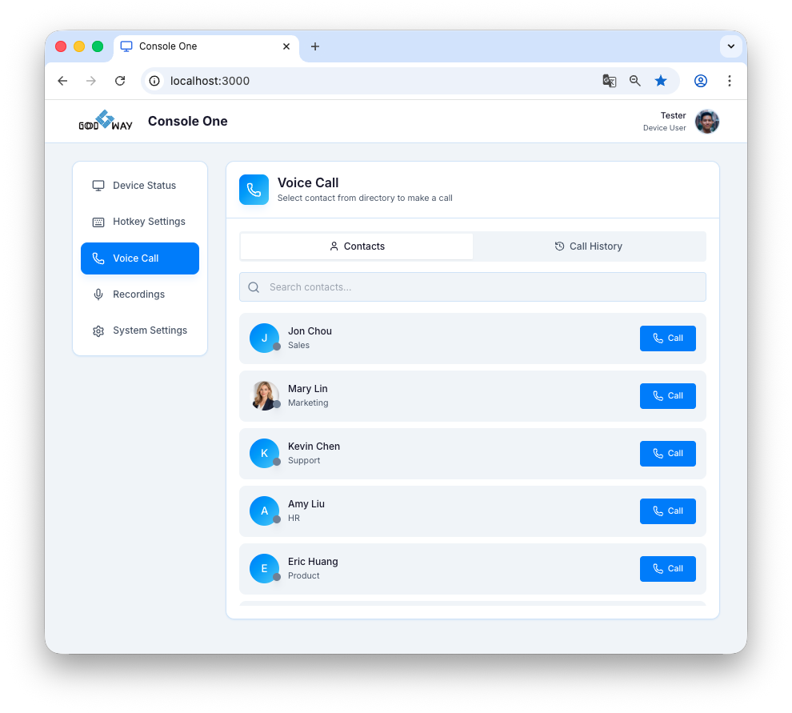
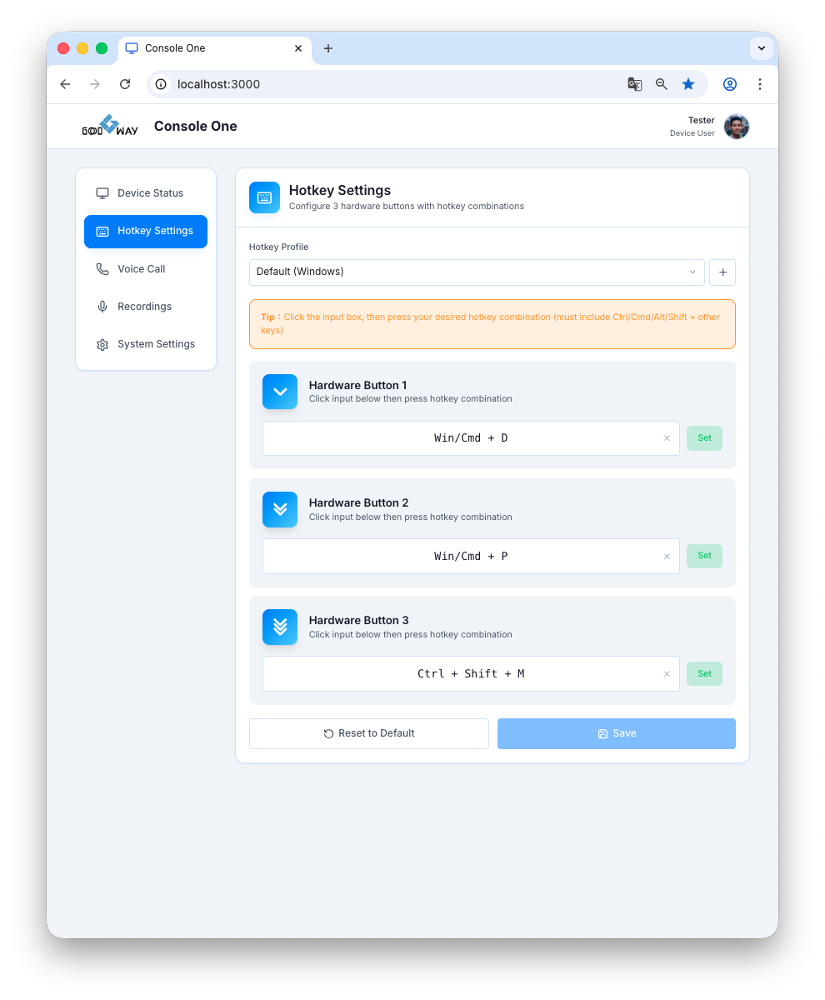

# Console One - Project Portfolio

## Project Overview
**Console One** is a frontend control panel designed specifically for Smart Docking Stations. This system provides device status monitoring, real-time call management, audio recording management, and hotkey customization, allowing users to effortlessly manage and configure their docking station devices through an intuitive web interface.

**Built with:**

## Key Features

- 📊 **Device Status:** Real-time monitoring of docking station connection status, peripheral port usage, and hardware metrics.
- 📞 **Voice Call Management:** Real-time communication with other Console One via WebRTC, featuring an active call bar, dial pad, and incoming call notifications.
- 🎙️ **Recordings Management:** An organized list interface to view, playback, and download past call and meeting audio records.
- 📝 **AI Transcription & Summarization:** Converts audio recordings into text transcripts and generates intelligent summaries for quick review.
- ⌨️ **Hotkey Settings:** Allows users to personalize and map external smart buttons on the dock or system-wide hotkeys to specific system actions.
- ⚙️ **System Settings:** Includes global preferences, audio device selection, and multi-language toggles.

---

## UI Gallery

### Dashboard & Device Status

> ✨ **Highlight:** Showcases the clean dashboard design and real-time device connectivity status.

### Voice Call Interface

> ✨ **Highlight:** Features the Active Call Bar along with the dial pad and in-call interaction UI.

### Recordings Management

> ✨ **Highlight:** A structured data list view integrated with a custom audio player.

### Hotkey Settings

> ✨ **Highlight:** Intuitive interface for customizing button mappings and form interactions.
