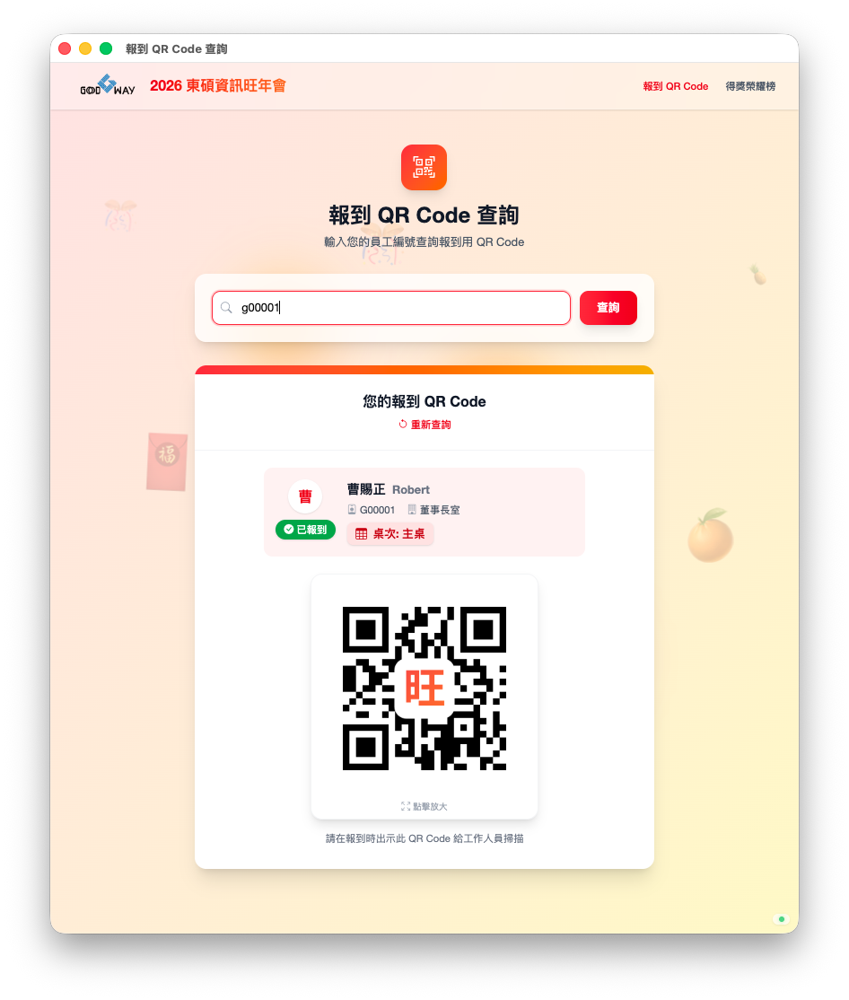
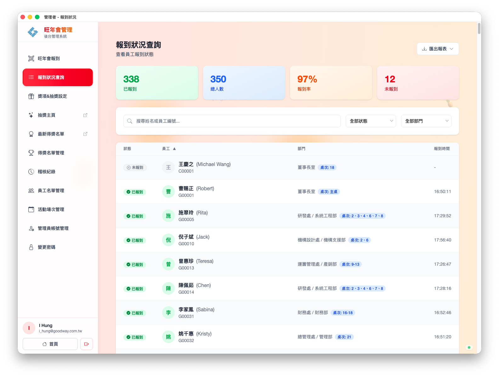
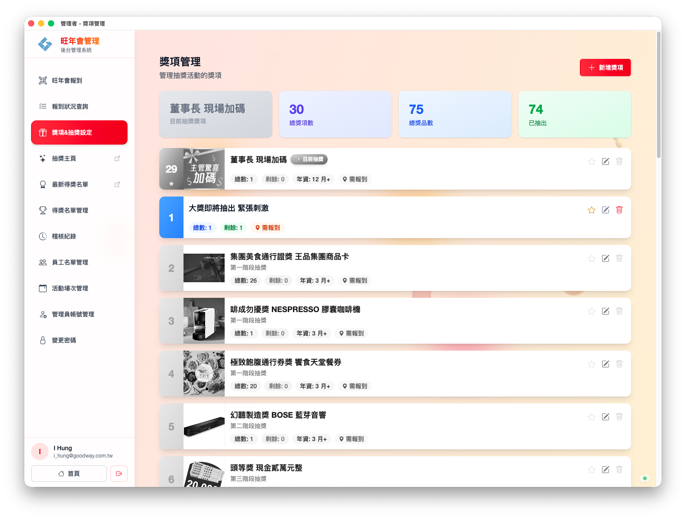

# Lottery System - Project Portfolio

## Project Overview
**Lottery System** is a comprehensive, real-time event management platform designed for high-concurrency corporate annual events. It bridges the gap between physical attendee presence and digital event management with a seamless QR code check-in process, an interactive live lottery system, and a robust administrator dashboard.

**Built with:**

## Key Features
*   **QR Code Live Check-in**: Employee portal for check-in tokens and an admin scanning module for instantaneous attendance logging.
*   **Real-time Synchronization**: Powered by SignalR to instantly update all administrative panels and public screens without page refreshes.
*   **Interactive Lottery Management**: Live draw system featuring secure randomized selection, duplicate elimination, and configurable prize settings.
*   **Robust Security & Auditing**: Utilizes secure JWT tokens for QR codes and maintains complete, transparent audit logs for all administrative actions.

## UI Gallery

### Employee QR Portal
Simple, mobile-friendly interface for employees to access their check-in QR code.

### Admin Dashboard & Check-in Monitor
Real-time overview of event attendance, department statistics, and check-in logs.

### Prize Management
Comprehensive tools for administrators to configure prizes, quantities, and eligibility rules.

### Live Lottery Interface
Visual and engaging live drawing screen synced across the entire venue.

