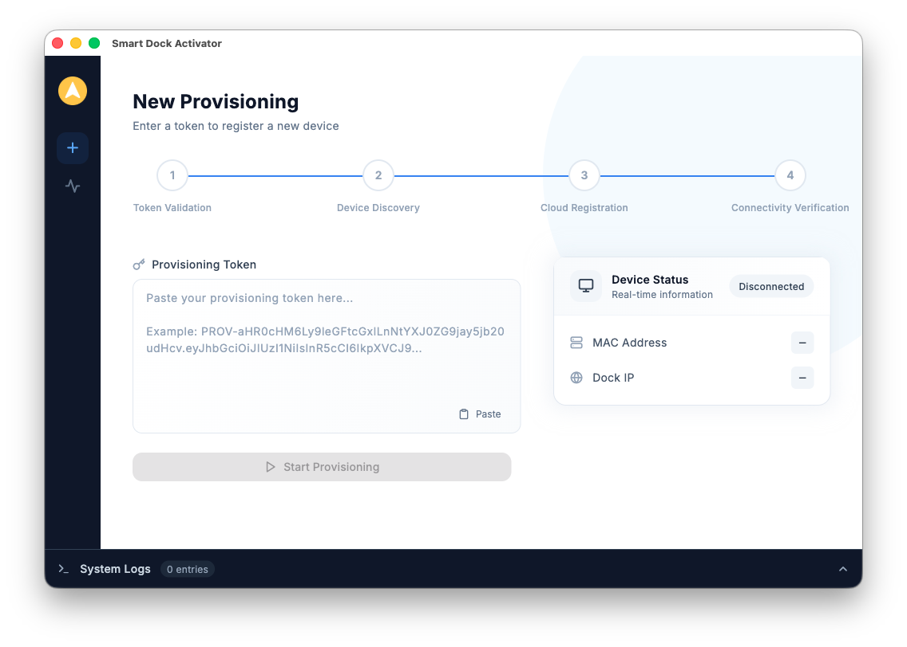
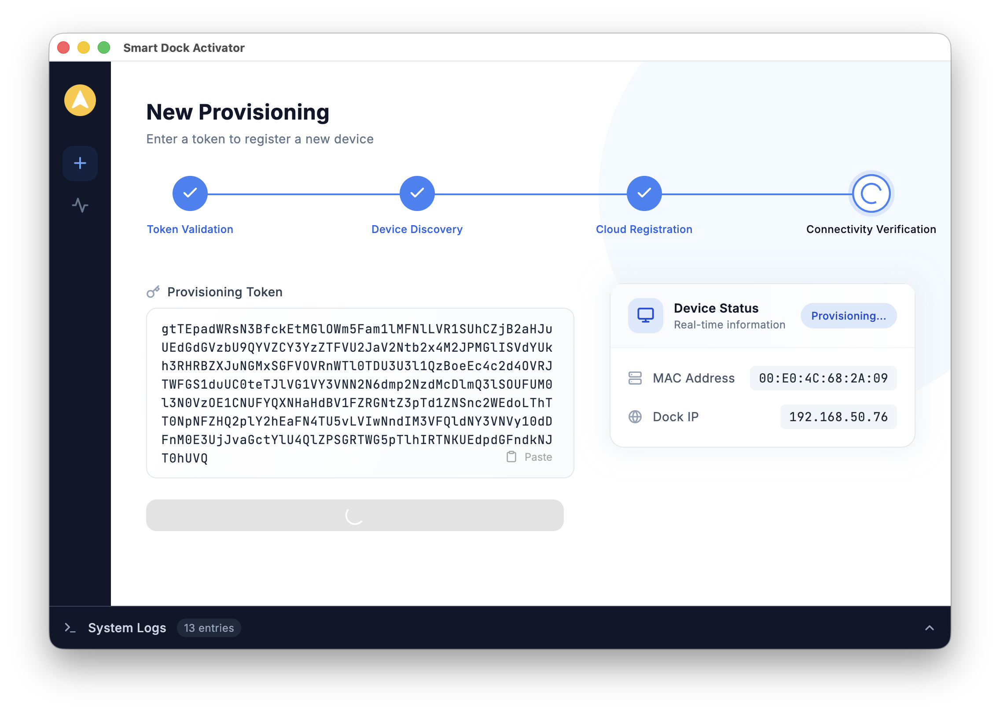
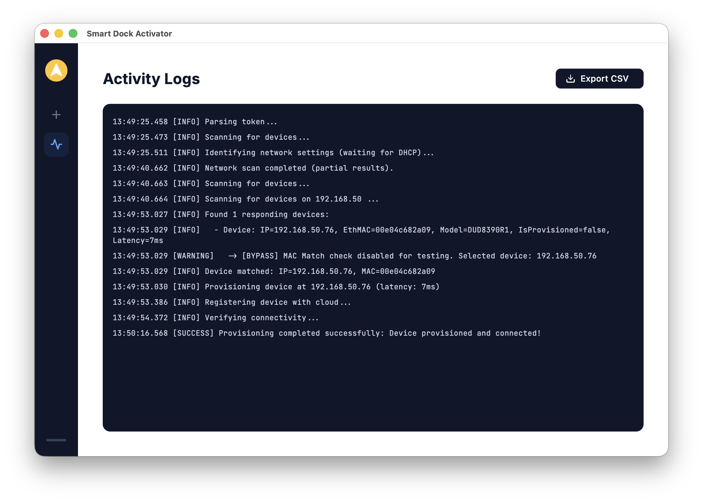

# Smart Dock Activator - Project Portfolio

## Project Overview
**Smart Dock Activator** is a desktop application designed for employees to easily activate their smart docking stations at home. IT administrators provide a secure provisioning token, and employees simply input this token to configure their dock, ensuring it connects securely to the corporate network without complex manual setup.

**Built with:**

## Key Features
*   **Token Provisioning**: Employees provision their dock using a secure token provided by IT.
*   **Simple Plug-and-Play**: Automatically discovers the dock on the home network.
*   **Clear Status Feedback**: Visual indicators show when the dock is connected and ready for use.
*   **Cross-Platform**: Works on the employee's preferred computer (macOS, Windows, or Linux).
*   **Troubleshooting Logs**: built-in logs help IT support diagnose issues remotely.

## UI Gallery

### Main Screen
The main screen provides a clear overview of all detected devices and their current status.

### Device Details
Detailed view of a specific device, showing connection information and activation status.

### Activity Logs
A dedicated panel for viewing system activities and troubleshooting errors.

